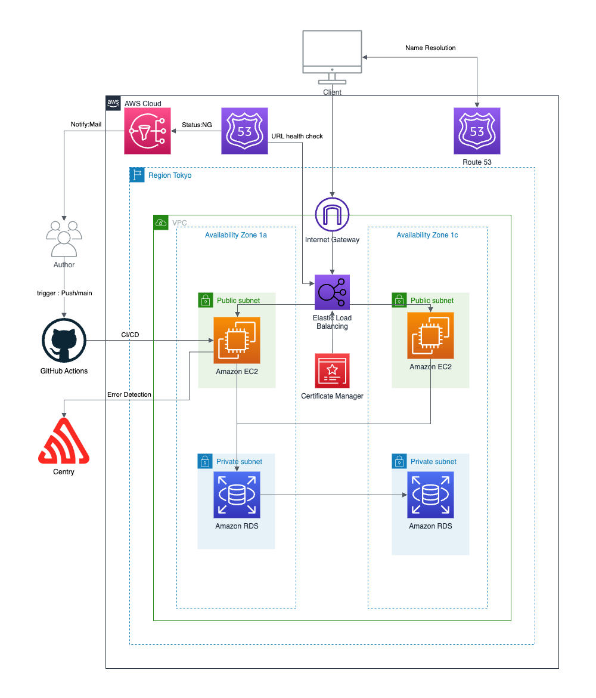

# アプレンティスの課題としてRealWorldに取り組みました

## 実装したエンドポイント

- [Registration](https://realworld-docs.netlify.app/docs/specs/backend-specs/endpoints#registration)
- [Authentication](https://realworld-docs.netlify.app/docs/specs/backend-specs/endpoints#authentication)
- [Create Article](https://realworld-docs.netlify.app/docs/specs/backend-specs/endpoints#create-article)
- [Get Article](https://realworld-docs.netlify.app/docs/specs/backend-specs/endpoints#get-article)
- [Update Article](https://realworld-docs.netlify.app/docs/specs/backend-specs/endpoints#update-article)
- [Delete Article](https://realworld-docs.netlify.app/docs/specs/backend-specs/endpoints#delete-article)

## +α要素

- ArticleとTagを多対多として用意し、中間テーブルで解決。
- Articleを削除した際は中間テーブルも合わせて削除、Tagはそのまま残す。
- Userを削除した場合はArticle、中間テーブルも連動して削除。

## エンドポイント

- PostmanのAPIURLを以下のURLで置き換えてテストを実施してください。

<a href="https://tapfindcase.com">https://tapfindcase.com</a>

## インフラ構成図

- ステップ3と4はGitHub Actionsを使用
- ステップ5はSentryを使用
- ステップ6はRoute53を使用

